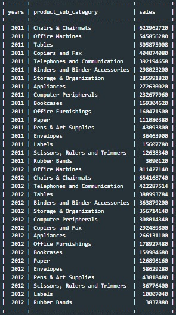
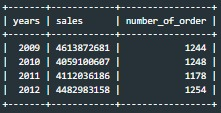

# 📊 DQLab Store Sales Analysis (2009-2012)

 


## 📌 Project Overview
This project aims to evaluate the business performance of **DQLab Store** over a four-year period (2009-2012). Using a dataset of **5,500+ transactions**, I conducted a deep dive into sales trends, promotion efficiency, and customer behavior to provide actionable insights for future marketing strategies.

## 🎯 Analytical Objectives
* **Performance Benchmarking**: Track yearly sales and order volume growth.
* **Promotion Efficiency**: Analyze the "Burn Rate" to identify the correlation between discounts and revenue.
* **Customer Insights**: Monitor unique customer acquisition and retention patterns.

## 🛠️ Tech Stack & Methodology
* **Tool**: MySQL.
* **Techniques**: Advanced Aggregations, Common Table Expressions (CTEs), Temporal Data Extraction, and Mathematical Modeling.

## 📂 Repository Structure
```bash
├── sql-scripts/
│   └── mysql_query.sql            # Main SQL Queries (A1-3A)
├── assets/
│   └── output_previews/           # Screenshots of Query Results
└── README.md                      # Project Documentation

```
## 🔍 Deep Dive: Technical Implementation & Insights

## 📊 1. DQLab Store Overall Performance

### 🅐 Overall Performance by Product Sub-Category

This section analyzes the **revenue performance of each product sub-category** at DQLab Store for **2011–2012**.  
Only **completed orders** are included to ensure the analysis reflects actual realized revenue.

---

### 🧩 SQL Query
```sql
SELECT 
    YEAR(order_date) AS years,
    product_sub_category,
    SUM(sales) AS sales
FROM dqlab_sales_store
WHERE YEAR(order_date) IN (2011, 2012)
  AND order_status = 'Order Finished'
GROUP BY 1, 2
ORDER BY 1, 3 DESC;
```

### 📈 Query Output



*The table above displays rows of sales performance data by product sub-category for 2011–2012.*

💡 Key Business Insights

🔹 Chairs & Chairmats
A stable and consistently growing revenue contributor, with an increase of approximately 31 million (+5%), indicating strong and sustained demand.

🔻 Office Machines
Experienced a severe revenue decline of around 465 million (−85%) in 2012. This may point to product obsolescence, pricing issues, or declining market relevance.

🔹 Telephones & Communication
Recorded positive growth of roughly 30 million (+8%), suggesting increasing adoption of communication-related products.

🔻 Tables
Sales dropped by approximately 117 million (−23%), potentially caused by weaker demand or stronger competition in this segment.

🔺 Binders & Binder Accessories
Showed strong year-over-year growth of about 66 million (+22%), highlighting this category as an emerging revenue driver.

🚀 Computer Peripherals
One of the fastest-growing categories, with sales increasing by approximately 75 million (+30%), reflecting rising dependency on computer support devices.

⚠️ Low-Revenue Categories
Several smaller categories exhibit high volatility, indicating unstable demand and limited strategic impact on overall revenue.


### 🅑 Overall Performance by Year  

This section evaluates **DQLab Store’s overall business performance by year** from **2009 to 2012**, focusing on total revenue and order volume.  
Only **completed orders** are included to ensure that the analysis reflects actual realized sales performance.

---

### 🧩 SQL Query
```sql
SELECT
    YEAR(order_date) AS years,
    SUM(sales) AS sales,
    COUNT(order_id) AS number_of_order
FROM dqlab_sales_store
WHERE YEAR(order_date) BETWEEN 2009 AND 2012
  AND order_status = 'Order Finished'
GROUP BY 1
ORDER BY 1;
```
### 📈 Query Output



*The table presents aggregated sales data, including total sales and order counts, grouped by year from 2009 to 2012.*

💡 Key Business Insights

📉 Peak Performance in 2009
Overall sales reached their highest point in 2009, totaling approximately 5.25 billion, establishing this year as the performance benchmark.

🔻 Sales Decline in 2010
Total sales dropped by around 13.6% in 2010, indicating a significant slowdown following the 2009 peak.

🧊 Weak Demand in 2011
The number of orders fell to its lowest level in 2011 (1,318 orders), aligning with stagnant sales performance and suggesting reduced customer activity.

📈 Recovery Trend in 2012
In 2012, sales rebounded by approximately 11%, while order volume increased to 1,392 orders, approaching 2009 levels.

⚠️ Efficiency Has Not Fully Recovered
Despite the recovery in total sales and order count, the average sales value per order in 2012 remains below the efficiency levels achieved in 2009.
